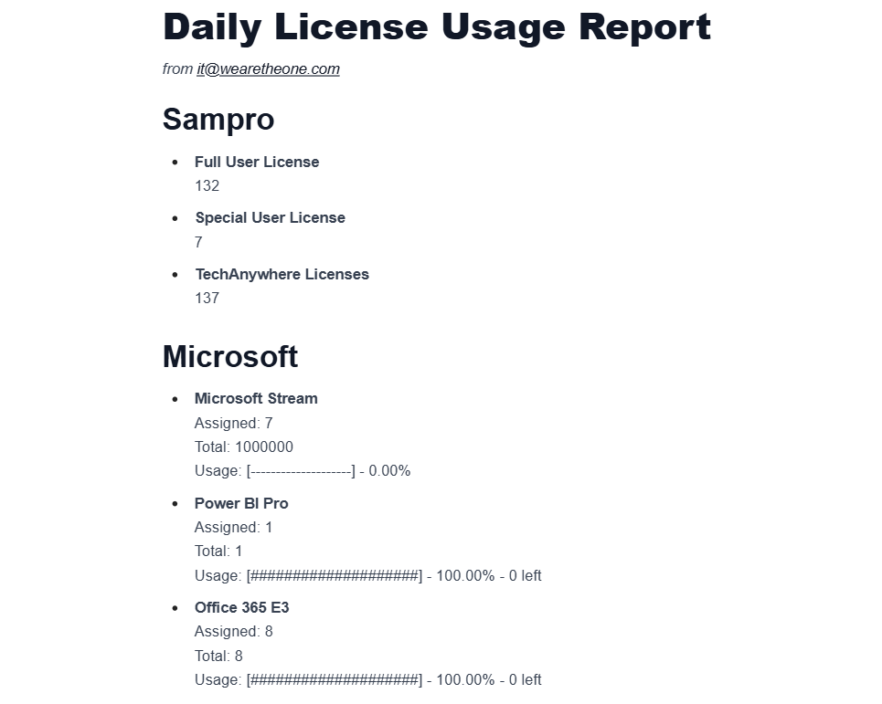

# License Report
Report Active Sampro Licenses Daily. \
See below screenshot \

## Deployment
AWS Lambda + AWS EventBridge (for daily invocation)
#### Zip Py Files (first zip, this will create a new zip)
Compress-Archive -Path .\\auth.py -DestinationPath .\\lambda_artifact.zip -Force
#### Zip Py Files (follow up zips, this will update existing zip)
Compress-Archive -Path .\\emailGenerator.py -Update -DestinationPath .\\lambda_artifact.zip
Compress-Archive -Path .\\main.py -Update -DestinationPath .\\lambda_artifact.zip
#### DO NOT INCLUDE .ENV FILE IN THE ZIP.
Use AWS Lambda Function env var to configure .env

## Create a Lambda Layer for Deployment
#### CLI commands
mkdir -p lambda_layer/python
pip install -r requirements.txt -t lambda_layer/python
cd lambda_layer
zip -r ../lambda_layer.zip
*for windows:* Compress-Archive -Path .\* -DestinationPath ..\lambda_layer.zip
cd ..
#### Creating layer on AWS Lambda
1. Go to AWS Console > Lambda > Layers
2. Click “Create layer”
3. Name it, upload lambda_layer.zip
4. Choose the Python runtime (e.g. Python 3.11) that matches your Lambda
5. Click Create
#### Attach layer to Function
In your Lambda function:
- Go to “Layers” > Add a layer
- Choose “Custom layers”, pick your newly created layer, and Add
#### AWS Lambda
[https://us-east-1.console.aws.amazon.com/lambda/home?region=us-east-1#/functions/sampro-license-daily-report?subtab=triggers&tab=code](https://us-east-1.console.aws.amazon.com/lambda/home?region=us-east-1#/functions/sampro-license-daily-report?subtab=triggers&tab=code)